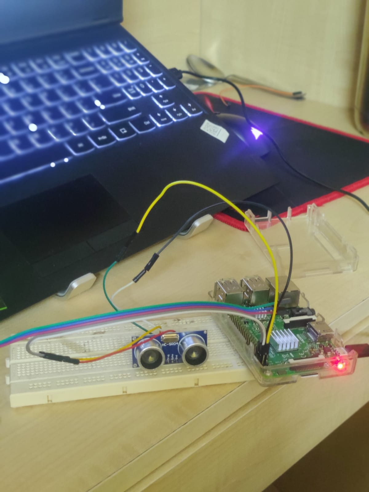

# Analysis of the Distance using a Ultrasonic Sensor

## Members of Project
* Aashish Joshua James [SE20UARI002]
*  Abhi Muvva [SE20UARI003]
* Bada Sriya [SE20UARI030]
* C. Yashwanth Reddy [SE20UARI169]

## Table of Contents
> Introduction
* Ultrasonic Ranging Module
* The Raspberry Pi
> Methodology

> Code
* Pre-Requisites
* Explanation of Code

> Results

## Introduction

### Ultrasonic Ranging Module (HC-SR04):
The HC-SR04 Ultrasonic Ranging Module is a sensor used for detecting the distance to an
object using sonar. The module consists of an ultrasonic transducer that can both emit and
receive ultrasonic waves. The transducer typically operates at a frequency of around 40 kHz.
It provides 2cm - 400cm non-contact measurement function, the ranging accuracy can reach
to 3mm. To measure distance, the HC-SR04 sends out a short pulse of ultrasonic sound (an
ultrasonic burst). This module operates at 5V DC and has two main pins: Trigger for sending
the ultrasonic pulse and Echo for receiving the reflected signal. To measure distance, you
typically send a short 10 microsecond pulse to the Trigger pin. The module then sends out
an ultrasonic pulse and starts a timer. When the reflected pulse is received, the Echo pin
goes high. By measuring the time, the Echo pin stays high, you can calculate the distance.

-> The HC-SR04 Ultrasonic Range Module
Features:
* Input Voltage: 5V
* Current Draw: 20mA (Max)
* Digital Output: 5V
* Digital Output: 0V (Low)
* Working Temperature: -15°C to 70°C
* Sensing Angle: 30° Cone
* Angle of Effect: 15° Cone
* Ultrasonic Frequency: 40kHz
* Range: 2 cm - 400 cm
* Dimensions
    * Length: 43mm
    * Width: 20mm
    * Height (with transmitters): 15mm
    * Centre screw hole distance: 40mm x 15mm
    * Screw hole diameter: 1mm (M1)
    * Transmitter diameter: 8mm

### The Raspberry Pi 

Raspberry Pi, that it is commonly known as, is a low-cost ARM GNU/Linux box. Hardly the
size of a credit card, this single board computer developed in the UK can be plugged into a
computer screen or TV and can function on a
standard keyboard and mouse.Launched with the
basic idea to educate basic computer science in
schools and developing countries, several
generations of Raspberry Pi have been released till
now. These boards are available in various price
ranges from $6 to up to $100 and even more
based on various features. The design of
Raspberry Pi is based on a Broadcom BCM2835
system on a chip (SoC) including ARM compatible
CPU with a speed ranging from 700 MHz to 1.2
GHz for the Pi 3 along with an on chip GPU. The
on board memory might range from 256MB to 1 GB RAM. The Raspberry Pi is a versatile
and low-cost platform that is widely used in Internet of Things (IoT) applications. Its small
size, GPIO pins for sensor interfacing, and powerful processing capabilities make it an
excellent choice for collecting sensor data, controlling devices, and sending data to the
cloud. The Raspberry Pi serves as a powerful IoT gateway, allowing the creation of
interconnected systems that collect, analyse, and act on data from the physical world,
making it a popular choice for IoT enthusiasts and professionals alike.

##  Methodology

Experiment Setup:

Experiment Ideology:
* We used an HC-SR04 Sensor to detect the distance and the change in distance of
objects present in front of it.

## Code
###  Requirements for the code:

Make sure you have the Adafruit GPIO library installed. You can install it using pip if it's not
already installed:
> pip install adafruit-blinka

### Working of the Code:
The Python code interfaces with an ultrasonic sensor (HC-SR04) and uses the Adafruit
Blinka and Adafruit CircuitPython HC-SR04 libraries to measure and display the distance
detected by the sensor in centimeters.

Detailed Description of the code:
* Imports Libraries:
    * Import the necessary Python libraries, including ‘time’ for time management,
‘csv’ for CSV file handling, and the required Adafruit libraries for GPIO and
sensor interfacing.
* GPIO and Sensor Initialization:
    * Initialize GPIO pins for the ultrasonic sensor's trigger and echo pins.
    * Create an instance of the ‘HCSR04’ class to interface with the ultrasonic
sensor.
* CSV File Setup:
    * Specify the filename for the CSV file as ‘distance_data.csv’.
    * Use a ‘with’ statement to open the CSV file for writing (‘mode='w'’).
    * Create a CSV writer object to write data to the file.
    * Write a header row with column names: "Timestamp" and "Distance (cm)".
* Data Collection Loop:
    * Enter a continuous loop using ‘while True:’ to repeatedly collect and save
distance data.
* Timestamp and Distance Measurement:
    * Get the current timestamp in the format "YYYY-MM-DD HH:MM:SS" using
‘time.strftime’.
    * Measure the distance in centimeters using the ultrasonic sensor and store it
in the ‘distance’ variable.
    * Print the timestamp and distance to the console for real-time monitoring.
* Write Data to CSV:
    * Write the timestamp and distance to the CSV file using the
‘csv_writer.writerow’ method. This appends a new row to the CSV file with
each iteration.
* Delay Between Measurements:
    * Introduce a 1-second delay using ‘time.sleep(1)’ to control the
measurement frequency. You can adjust this delay to change the frequency.
* Exception Handling:
    * Handle a keyboard interrupt (‘KeyboardInterrupt’) to allow the user to stop the program gracefully with Ctrl+C.
* Cleanup:
    * Deinitialize the sensor and clean up GPIO pins (‘sensor.deinit()’) before
exiting the program.

The code continuously collects distance measurements from the ultrasonic sensor, records
the timestamp, and saves this data to a CSV file. This format allows you to log and analyse
the data over time.

## Results:
Here is a subset of results that we got.

|Timestamp | Distance (cm)|
|----------|---------------|
2023-09-27 18:34:19| 45.2
2023-09-27 18:34:20| 44.9
2023-09-27 18:34:21| 40.7
2023-09-27 18:34:22| 39.5
2023-09-27 18:34:23| 37.3

